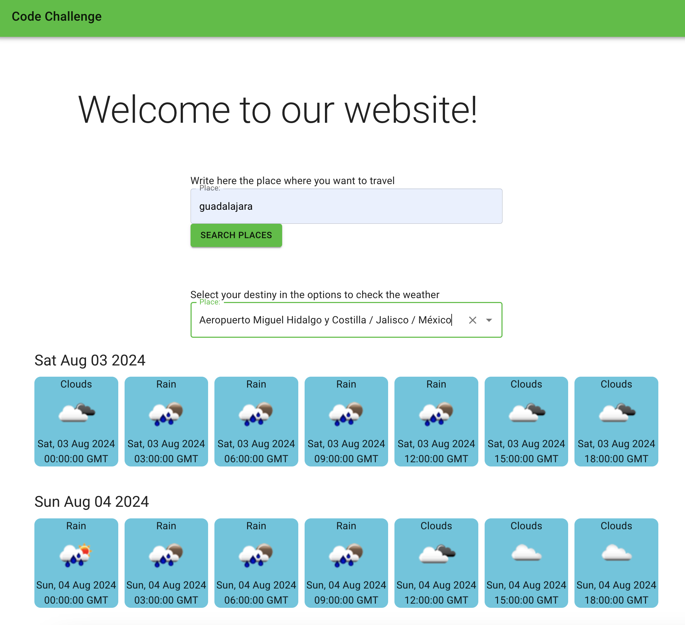

# Reservamos Code Challenge

**Welcome!**  

This challenge lets you showcase your skills building an application to check the weather in the place you want to visit.

This project uses the API of [OpenWater](https://openweathermap.org/forecast5) and API of Reservamos ``https://search.reservamos.mx/api/v2/places``.

**Requirements:**

* **Node.js:** Ensure you have version 20 or higher installed. Verify it with `node -v` in your terminal.
* **Browser:** You'll need a modern browser (Chrome, Firefox, Edge, etc.) to run the application.

**Instructions:**

1. **Clone or Download the Project:**

   **a. Git (comfortable users):**

      ```bash
      git clone git@github.com:MartinRob13/check-weather-app.git
      ```

   **b. Download:** Alternatively, download the project as a ZIP from your GitHub repository and extract it to your desired location.

2. **Install Dependencies:**

   Open your terminal or command prompt, navigate to the project directory, and run:

   ```bash
   npm install

3. **Run the Application:**

  Start the development server with:

  ```bash
  npm run dev
  ```


This launches the application in your default browser, usually at http://localhost:5173/.




4. **Next Steps (Optional):**

  This version can be improved:

  - UI Improvements: Enhance the visual appeal and user experience for the weather list.
  - Component Structure: Break down the code into smaller, reusable components for better organization and maintainability.
  - Loading Indicator: Integrate a visual element (e.g., loading spinner, progress bar) to indicate weather data fetching.
  - Side effects: There is one side effect that makes that sometimes the first change of the place doenst show the weather data.
  
**Developer:**

[Martin Robledo](https://github.com/MartinRob13)

Email: martrob@gmail.com
